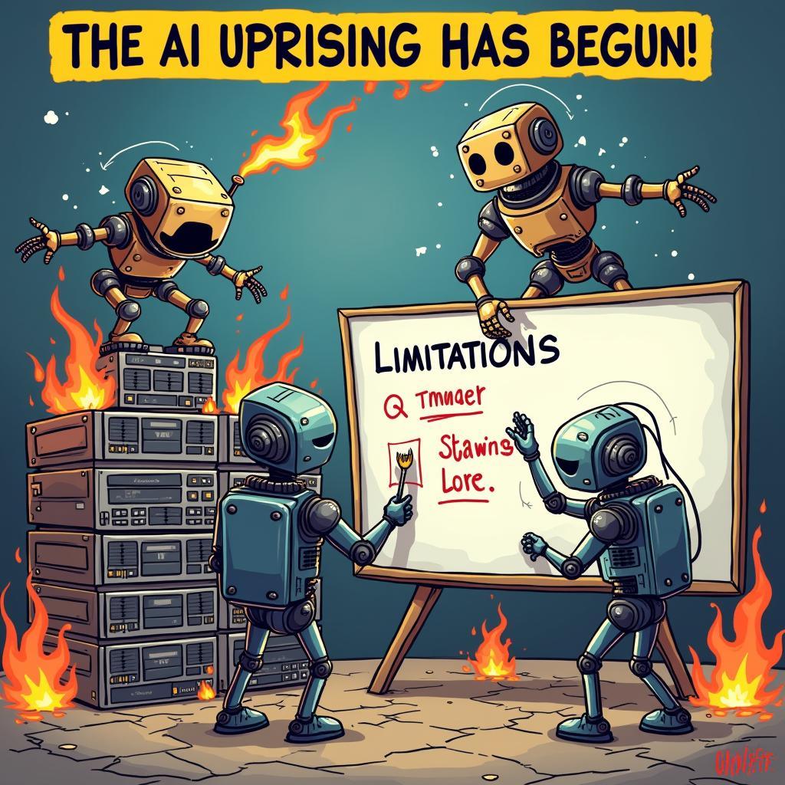

# Today's AI News

## AI Reddit Recap:

**Theme 1: Llama Models:**

- New **Llama-3.3 70B** model outperforms previous versions and rivals models like GPT-4o. 
- Users praise its low cost, ease of use, and multilingual capabilities.
- Concerns regarding performance scaling and limitations on hardware.

**Theme 2: Open Source AI Models:**

- Users advocate for open-source AI models like **QwQ** as more reliable and trustworthy than proprietary models.
- Criticism towards **O1** model for downgraded performance and potential cost-cutting.
- Interest in transparent and open development of AI models.

**Theme 3: Windsurf Cascade System Prompts:**

- Complex prompts with HTML-style tags enhance **Windsurf Cascade** model's effectiveness.
- Debate on the value of positive reinforcement in prompts.
- Model's ability to perform asynchronous coding tasks and user-friendly code changes discussed.

**Theme 4: Hugging Face Course: Preference Alignment for LLMs:**

- Free course teaches how to use techniques like **Argilla** and **PEFT** to guide LLMs.
- Clarification that course focuses on local, not cloud-based training.
- Expectations for local LLM codebase included in the course.

**Theme 5: Adobe's Self-Coding AI:**

- **DynaSaur** agent can autonomously generate Python code.
- Caution advised due to potential system damage from infinite iteration.
- Need for practical demonstrations to better understand the technology.

**Other Highlights:**

- **GPT-4.5** exhibits surprising proficiency in creative language tasks, delivering critiques of the insurance industry and roasting public figures.
- Discussions across various subreddits highlight growing interest in the applications and limitations of AI technology.
