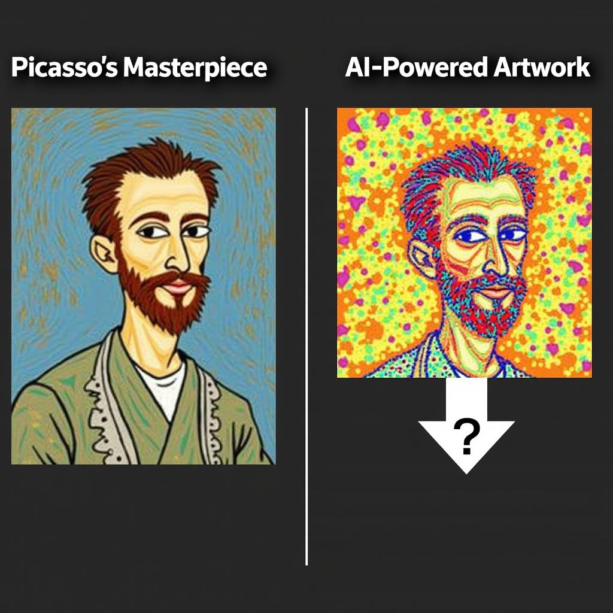

# Today's AI News

## AI Reddit Recap:

**Hot Topics:**

* **DeepSeeks V2.5:** Final release offers significant performance improvements and is generating much discussion. 
* **InternVL2.5:** Powerful new MLLM surpassing previous benchmarks and sparking debates about its capabilities.
* **Google Willow:** Quantum computing chip achieves mind-blowing speed, revolutionizing the field.

**Other Interesting Posts:**

* **AI art being sold at art galleries:** AI-generated paintings raise questions about authenticity and the nature of art in the digital age.
* **ChatGPT & product recommendations:** Users share experiences with AI-powered product discovery, highlighting its potential for niche product recommendations.
* **Sora video generator:** Initial reactions are positive, with users impressed with its capabilities in generating videos and dance moves.

**General Sentiment:**

The discussions show a growing excitement and optimism surrounding AI tools, especially for their potential to democratize creative endeavors and revolutionize tasks previously out of reach. Concerns about accessibility and limitations are also present, but users generally express hope for future advancements.
