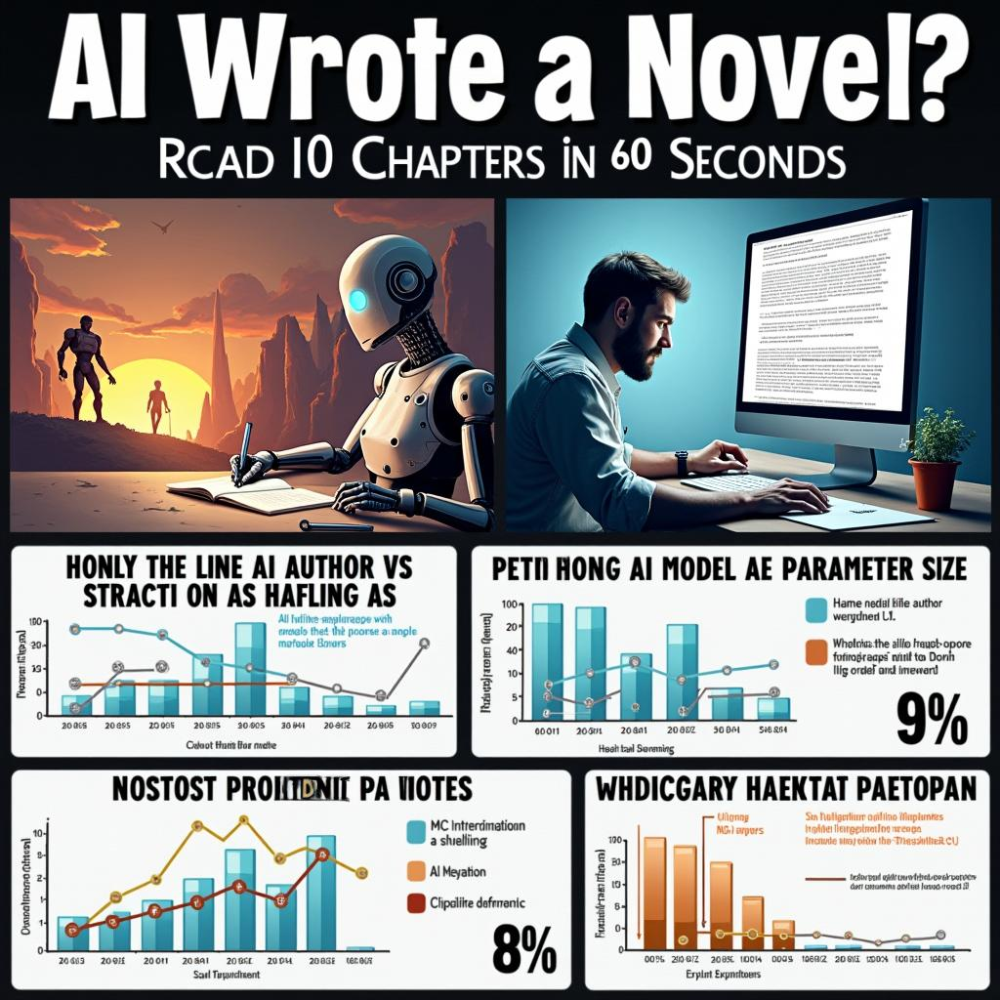

# Today's AI News

## Summary of AI Reddit Recap:

**Interesting AI developments and discussions from the Reddit Recap:**

**1. Evaluating Large Language Models:**
- Discussion about the judgment arena results where ChatGPT initially topped but later dropped due to suspicious voting patterns.
- Concerns over lack of concrete evaluation criteria and potential "pink elephant effect" influencing scores.

**2. Real-time Facial Recognition:**
- Demonstration by a Dutch journalist of AI identifying individuals in live conversations.
- Privacy concerns and practical applications discussed.

**3. CogVideoX 1.5: Image-to-Video Quality vs. Performance:**
- Comparison of implementations of BF16 and FP8 on performance metrics and quality.
- Quantization challenges and need for specific setup on Windows.

**4. Collaborative AI Novel Writing:**
- 10 autonomous AI agents collaborating to write a novel in real-time.
- Skepticism regarding the coherence and quality of AI-generated long-form content.
- Discussion on the format and coordination system for multi-agent creative writing.

**5. StepFun's 1T Parameter Model:**
- New large model from Chinese startup StepFun performing well in livebench rankings.
- Highlights increasing competition in AI model development from Chinese companies.

**Other notable findings:**
- Potential new "scaling law" for inference compute rather than training compute.
- Increasing focus on inference optimization as an alternative to parameter scaling.
