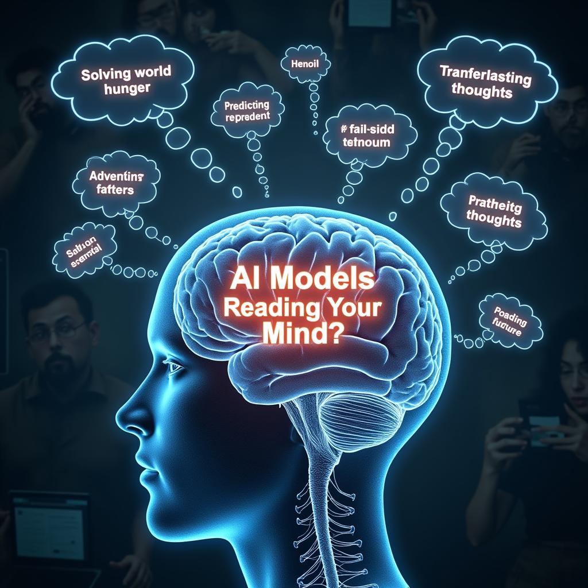

# Today's AI News

## AI Reddit Recap (March 5, 2025)

**Main Highlights:**

* **Apple releases new Mac Studio with M4 Max and M3 Ultra:** Offers up to 512GB unified memory and a powerful GPU, sparking discussions about its AI capabilities.

* **Qwen/QwQ-32B model release:** Generates excitement for its potential performance improvement over previous models, with benchmarks and live demos available.

* **TeaCache enhancement for WAN 2.1:** Users report a speed boost after installing TeaCache, raising hopes for improved stability and efficiency in AI training.

* **Lightricks LTX-Video v0.9.5:** Updated with keyframes, video extension, and higher resolution support, sparking creativity and workflow discussions.

* **Chroma model releases:** An open-source, uncensored model with 8.9B parameters, generating controversy over dataset size and legal concerns.

* **GPT-4.5 for Plus users:** Limited rollout with memory capabilities and rate limits triggers discussions about accessibility, performance, and potential future updates.

**Other Notable Topics:**

* The limitations and potential of LLMs for simple calculations.
* Discussions surrounding the ethical and legal considerations of training massive AI models.
* The increasing accessibility and capabilities of large language models like GPT-4.

**Humorous Highlights:**

* Aidan McLaughlin's humorous exaggeration about GPT-4.5's energy consumption generating widespread laughter and discussion.
* Users finding humor in the absurdity of AI-related claims and conversations.
