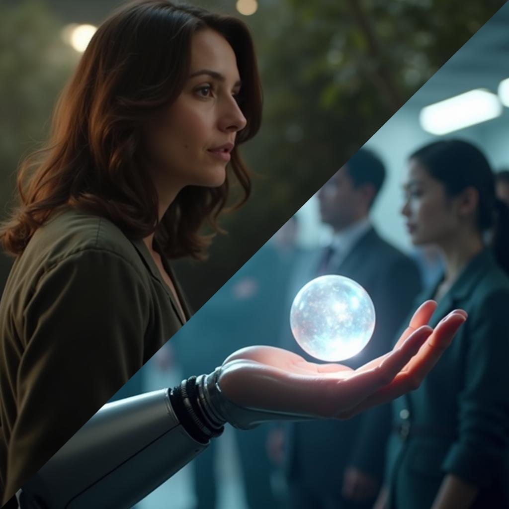

# Today's AI News

## AI Reddit Recap:

**Theme 1: Model Capabilities and Benchmarks**

- **Gemini 2.0:** Discussion of its limitations in reasoning and creativity despite advancements.
- **Llama-3_1-Nemotron-51B:** New model balancing speed and comprehension, outperforming models like Gemma-2-27b on certain tasks.
- **Tokenization:** Challenges in traditional tokenization methods are questioned, with potential for better alternatives like Byte Latent Transformer.

**Theme 2: Hardware and Performance**

- **AMD GPU Benchmark:** Potential for future improvement despite current software limitations.
- **MI300X vs H100 vs H200:** Early benchmarks suggest AMD's potential in training workloads.

**Theme 3: AI in Entertainment**

- **Veo 2's AI Short Films:** Praised for its cinematic quality, raising comparisons to Sora.
- **Future of AI in Film:** Discussions on the potential disruption of traditional filmmaking processes.

**Theme 4: Evaluating AI Models**

- **O1 Pro:** User reviews of its performance, cost, and potential value compared to other models.

**Other Highlights:**

- Mixed reactions to Microsoft's delay in releasing Phi-4.
- Discussion about the potential for AI in reasoning and artistic expression.
- Concerns about the accessibility and cost of advanced AI models.
