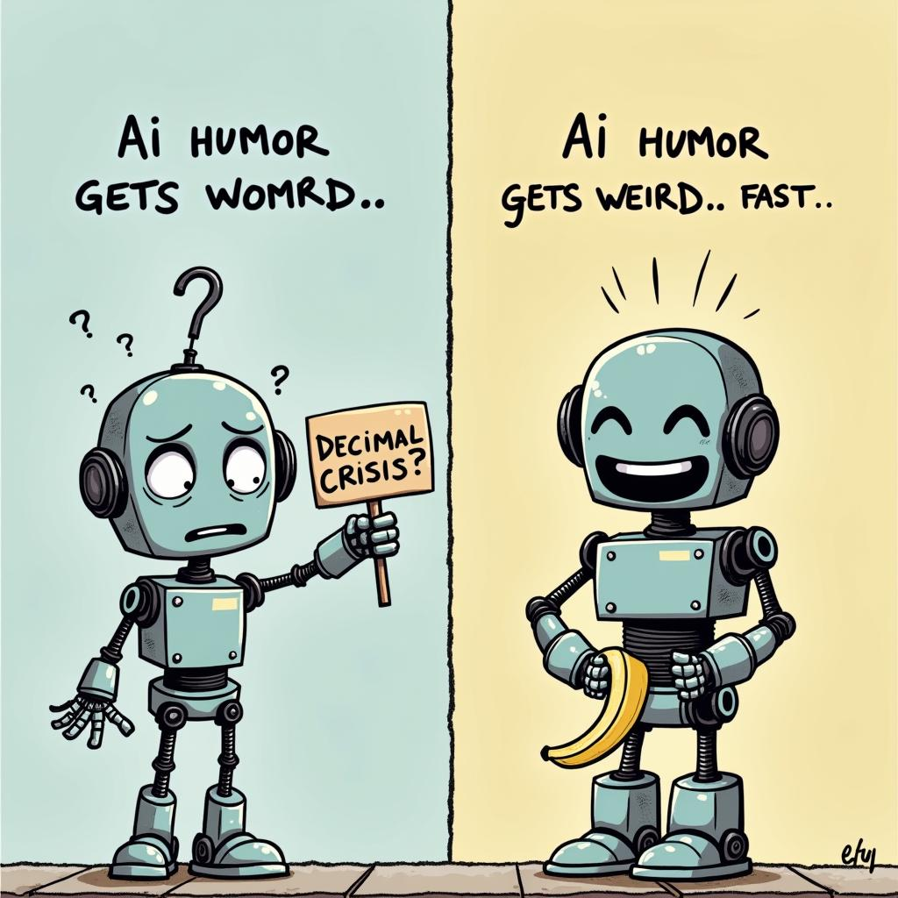

# Today's AI News

## AI Reddit Recap:

**1. Qwen2.5-VL-Instruct:** This model excels in visual and video tasks, offering improved object recognition, video understanding, and structure generation capabilities. Some concerns exist regarding its compatibility and computational requirements.

**2. Reverb-7b:** This new AI model from Ozone AI surpasses other 7B models in the Open LLM Leaderboard, showing impressive performance on the MMLU Pro dataset. However, concerns remain about its creative writing abilities.

**3. SmolVLM2:** This open-source video model offers efficient and compact options, performing tasks such as video description segmentation and highlight extraction. Its zero-shot vision capabilities and accessibility are highlighted.

**4. Open-source AI agents:** An agent using Canva was showcased, potentially bypassing CAPTCHAs. This project is open-sourced and available, raising interest in its compatibility with other multimodal models.

**Other notable discussions:**

- Multi-modal AI systems struggle with decimal number understanding, mirroring human initial confusion, but can self-correct.
- Humor and self-awareness emerge in AI responses, mirroring human behavior in recognizing and correcting mistakes.
