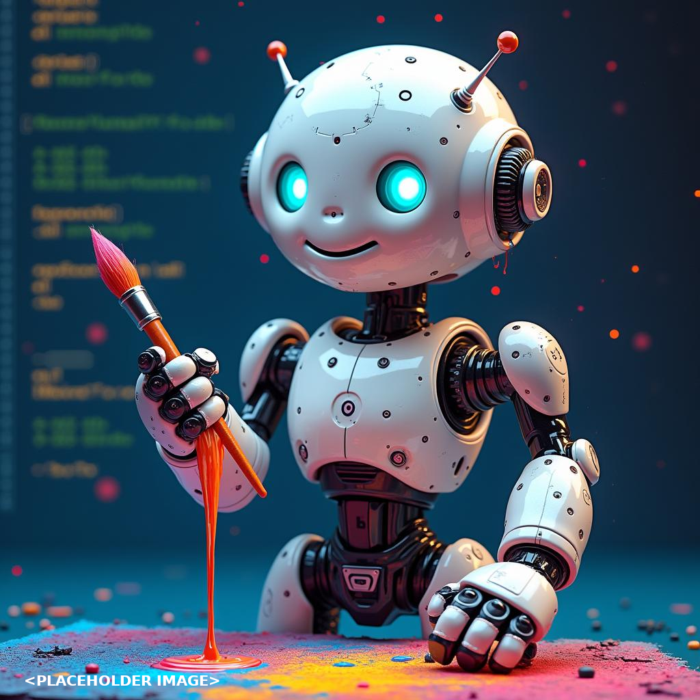

# Today's AI News

## AI Recap:

**Themes:**

**1. Hardware & Quantization:**

* HP unveils an AI machine with 128 GB Unified RAM.
* DeepSeek V3 achieves surprising performance with 2-bit quantization.
* Discussions explore quantization techniques and hardware optimization strategies.

**2. Models & Benchmarks:**

* Phi-4 outperforms other models on reasoning benchmarks despite its smaller size.
* Aider shows advantage over Cline for large codebases.
* Curiosity about application of open-source models like Mistral and Llama.

**3. Applications & Industry:**

* Over 25% of Google's new code is generated by AI.
* NVIDIA's Cosmos model allows for creation of virtual worlds.
* Discussions ponder the impact of AI on software development and jobs.

**4. Miscellaneous:**

* Elon Musk promises an AI better than ChatGPT, generating skepticism and sarcastic reactions.
* Other subreddits highlight advancements in various fields like singularity, robotics, and open AI models.

**Highlights:**

* Unified RAM AI machine with 96GB VRAM promises efficient performance for large models.
* 2-bit quantization shows potential for memory savings and accessibility.
* ChatGPT's capabilities are increasingly questioned, with concerns over its limitations and impact on professions.
