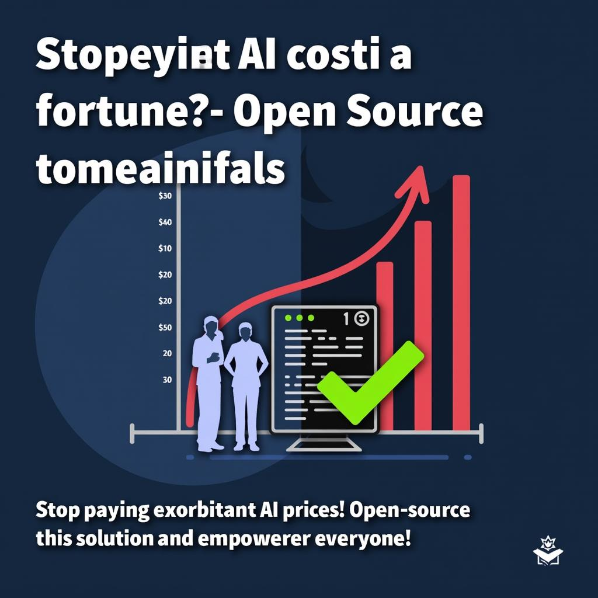

# Today's AI News

## Summary of AI Reddit Recap:

**Theme 1: Model Performance & Cost**

- OpenAI's O3 model shows remarkable performance on the ARC-AGI benchmark but comes at a high cost.
- Concerns about the cost-effectiveness and accessibility of such models are widespread.
- Discussions of the potential for open-source alternatives and more affordable options in the future.

**Theme 2: New Frontiers in AI Modeling**

- Qwen QVQ-72B model is speculated to have vision/video capabilities and impressive coding skills.
- Qwen2.5 technical report emphasizes progress in reasoning and code checking abilities.
- Enthusiasm for the potential of RWKV models to surpass traditional transformer-based models.

**Theme 3: OpenAI & Big Tech Competition**

- OpenAI's o3 model performance sparks debate with concerns about potential data contamination and cost.
- Google's Gemini 2.5 model is seen as competitive but faces skepticism about its limitations.
- Discussions about the pricing trajectory, accessibility, and the balance between commercial and open-source AI solutions.

**Theme 4: Open-Source AI & The Need for Evolution**

- Advocate for open-source AI as a necessary step for fostering competition and affordability.
- Concerns about the exclusivity and potential for exploitation with proprietary AI models.
- Discussions of the challenges and opportunities presented by the evolution of AI technologies.
