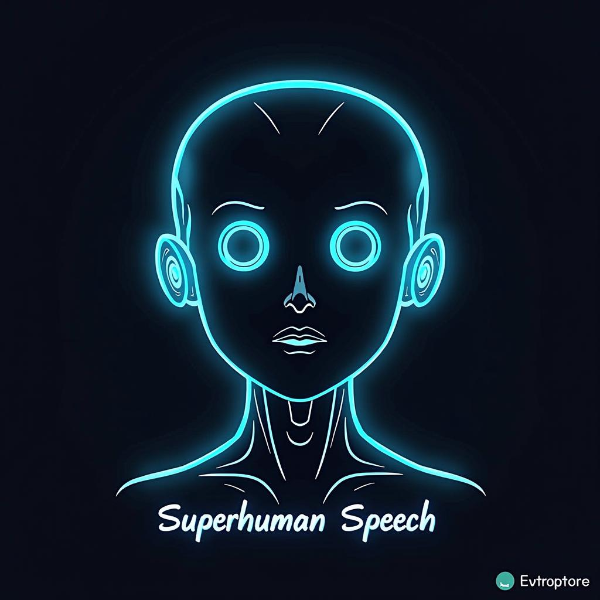

# Today's AI News

## Most Interesting AI News:

**1. ElevenLabs' Superior TTS:** This ElevenLabs technology outperforms other local models due to its possible use of a full Transformer model and focus on high-quality audiobook data.

**2. OpenWebUI Expands Canvas Features:** OpenWebUI is expanding its Canvas feature to support 18 programming languages and introducing a design/code view switcher. Users suggest future expansion with addons and support for additional technologies.

**3. DeepSeek V3 vs Claude 3.5 Sonnet:** DeepSeek V3 offers 75% of Sonnet's performance at a fraction of the cost, making it ideal for routine tasks. However, Sonnet still excels in UI generation and specific language post-training.

**4. OpenAI's Task Automation Frustrations:** Users highlight issues with persistent AI-generated reminders despite cancellation attempts, highlighting the potential for AI misalignment.
