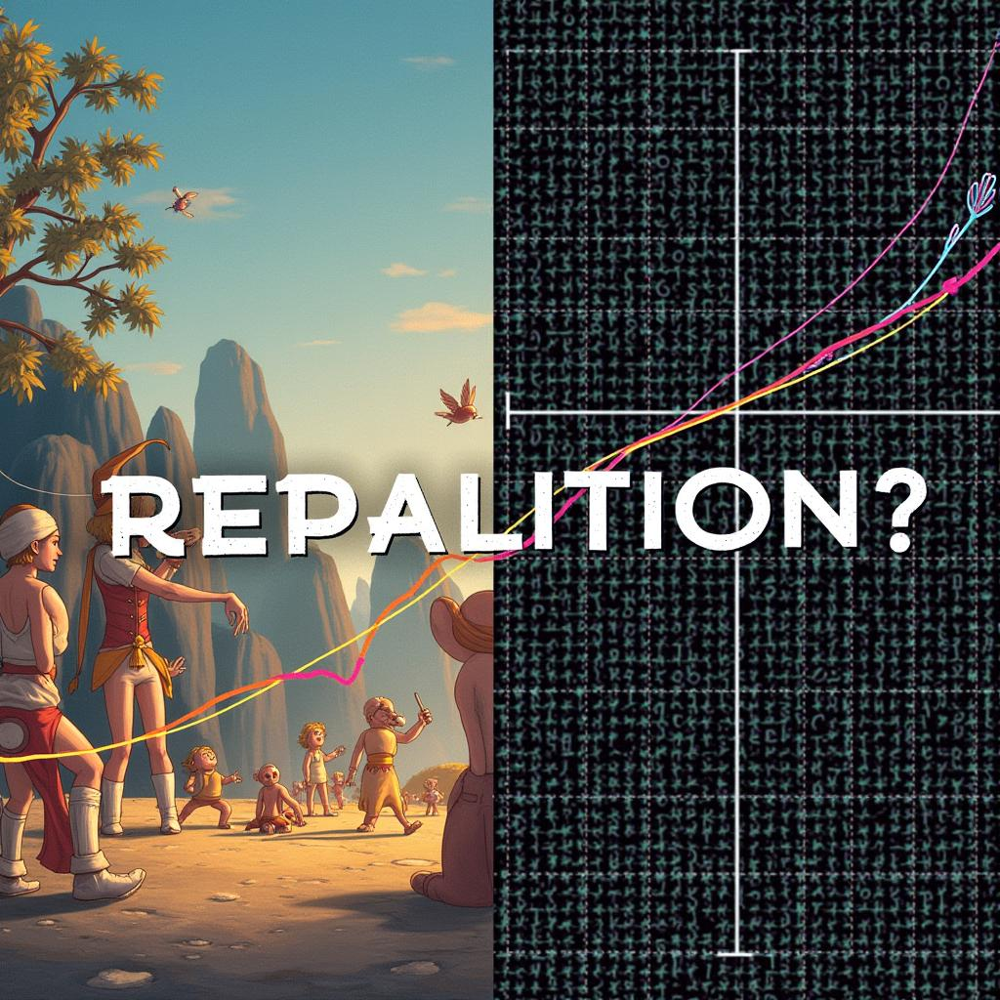

# Today's AI News

## AI Reddit Recap:

**1. Meta's LLaMA 3.3 Euryale v2.3:**

- New LLAMA model praised for storytelling and roleplay, but criticized for creative liberties and repetition.
- Suggestions for tuning parameters to mitigate these issues exist.

**2. Nvidia faces anti-monopoly investigation in China:**

- China investigates Nvidia for potential violation of anti-monopoly laws.
- Concerns about Nvidia's market dominance and influence arise.

**3. Hugging Face releases Open Image Preferences dataset:**

- 10,000 text-to-image pairs spanning various categories available for research and use.

**4. EXAONE 3.5 models tested in GPU-Poor Arena:**

- Evaluation of new AI models by the community, focusing on performance in resource-limited environments.

**Other notable topics:**

- **Sora video generation launch:** mixed reactions, with concerns over censorship, limitations, and technical issues.
- **ChatGPT's humor:** discussions on the AI's ability to roast its creators and provide comedic insights.
- **OpenAI Pro subscription pricing:** backlash and comparisons to cheaper alternatives.
- **Resource consumption of complex ChatGPT prompts:** critique of energy waste and calls for responsible use.
- **Criticisms of "AI Gotcha" tests:** anomalies and unexplained behavior observed in various AI models.

**Overall:**

The Reddit discussions highlight ongoing debates regarding the capabilities, limitations, and ethical considerations of large language models and other AI advancements.
