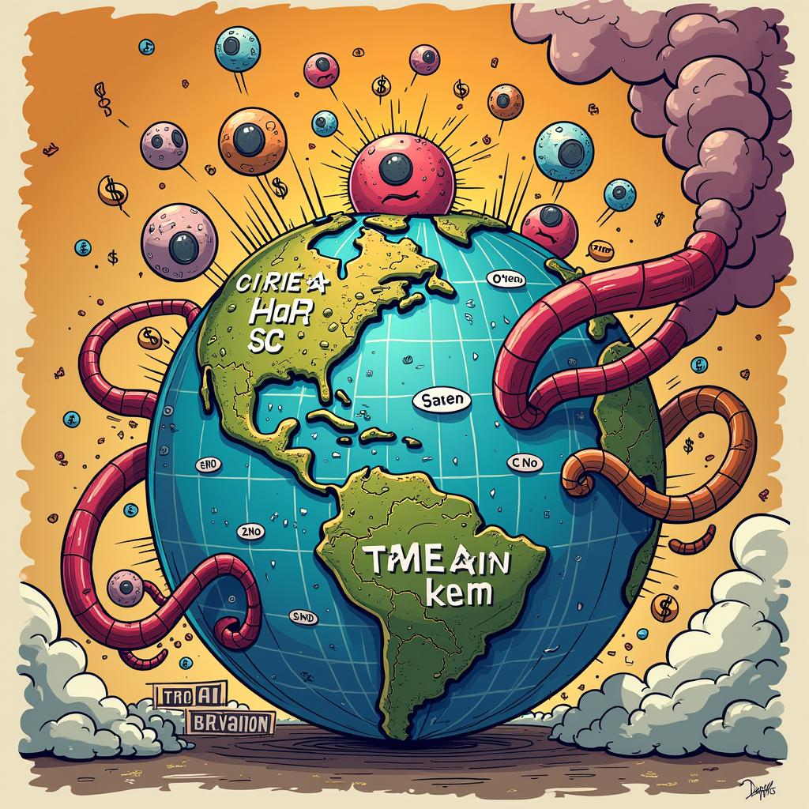

# Today's AI News

## AI Reddit Recap:

**Theme 1: DeepSeek V3 Hardware & Performance:**

- DeepSeek V3 running on llama.cpp showcases promising performance, but lacks specific details.
- Model quantization and memory location impact performance.
- Development ongoing with a new pre-tokenizer regex in the pipeline.

**Theme 2: Alibaba's Price Cuts for LLMs:**

- Alibaba slashes prices for LLMs by up to 85%, fueling competition in the Chinese AI market.
- China's focus on AI and green energy provides cost advantages.

**Theme 3: Qwen: The Preferred LLM:**

- Qwen2.5 models dominate, particularly for general use and coding.
- Users compare models and discuss size, quantization, and performance trade-offs.

**Theme 4: DeepSeek's Market Penetration:**

- Deepseek developers request user feedback for future features like UI improvements and Apple support.
- Community suggests distributed training, cost-effective datasets, and full-finetuning capabilities.

**Other Subreddit Highlights:**

- **Deepseek vs. OpenAI 01:** Skepticism surrounds Deepseek's claim of surpassing OpenAI's model. Concerns over China's AI strategy also arise.
- **RAG for Email Knowledge Retention:** Potential privacy violations and legal restrictions discussed alongside implementation challenges and data accuracy concerns.
