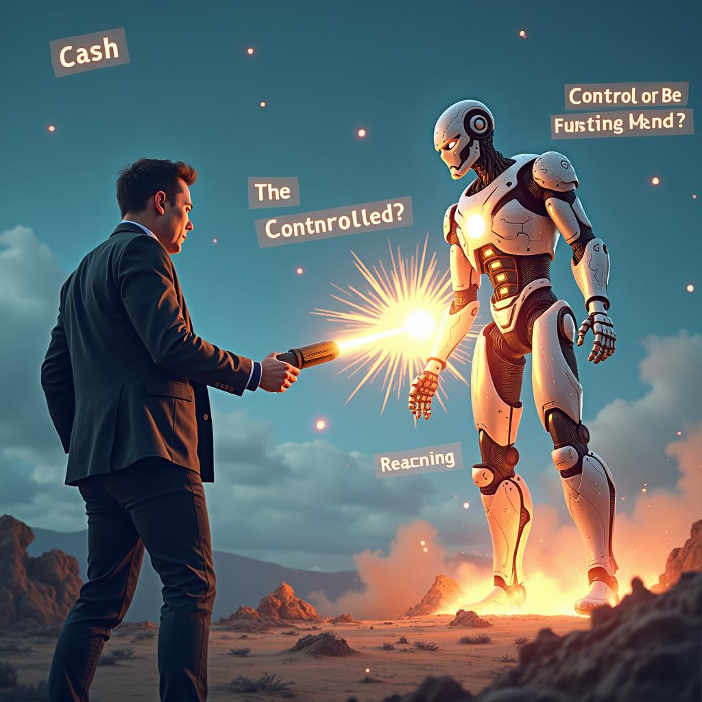

# Today's AI News

## AI Reddit Recap:

**Elon Musk vs. Sam Altman:**

* Musk offered $97.4 billion for OpenAI, which Altman humorously declined.
* Discussions speculate about Musk's true intentions and power struggles at OpenAI.
* Some prefer Altman's leadership, criticizing Musk's controversial tactics and lack of innovation.

**OpenAI Developments:**

* DeepScaleR-1.5B model advances reinforcement learning for smaller models.
* New open-source architecture lets users apply R1 reasoning to any LLM.
* Concerns raised about the feasibility of using few-shot prompting for complex reasoning.

**Other AI News:**

* Grok 3, Musk's new AI project, faces criticism over its viability and financial implications.
* Analyst claims Musk's offer for OpenAI is a strategic move to obstruct their for-profit transition.
* Discussions on the competitive landscape of AI, debating the importance of achieving AGI and potential hardware limitations.
