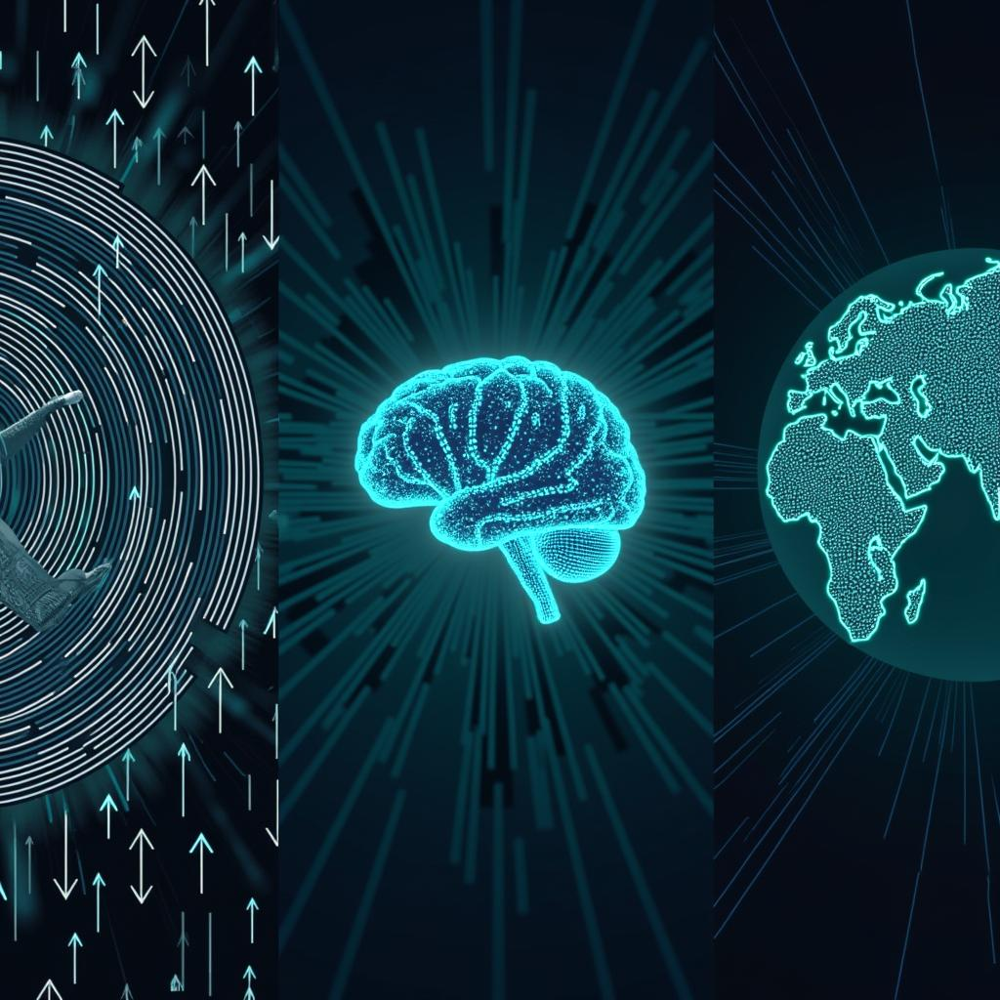

# Today's AI News

## AI Reddit Recap:

**Highlights:**

* **NVIDIA Digits:** A $3,000 personal AI supercomputer with 128GB RAM that promises to revolutionize local AI. 
* **Fine-Tuning Success:** Fine-tuning 3B model on math data resulted in 2-3x performance improvement without affecting other metrics.
* **RTX 5000 Series:** Criticism surrounding VRAM capacity and misleading performance comparisons.
* **NVIDIA & AMD Battle:** AMD's Strix Halo workstation competes with NVIDIA's new offerings, but lacks the performance of high-end GPUs.
* **Feeling Overwhelmed:** Discussion about the rapid pace of AI advancements and the resulting anxiety and overwhelm.

**Other notable news:**

* New CLI tool for improving prompts using a genetic algorithm
* NVIDIA releases open-source video world model "Cosmos" trained on 20 million hours of video
* Discussion on the potential impact of AI advancements on jobs and industries

**Themes:**

* Access to AI technology becoming more affordable and accessible.
* Continuous improvement and pre-training of AI models leading to significant performance gains.
* Ethical and practical concerns surrounding the rapid development of AI.
* Discussions of the potential societal and economic impact of AI advancements.
