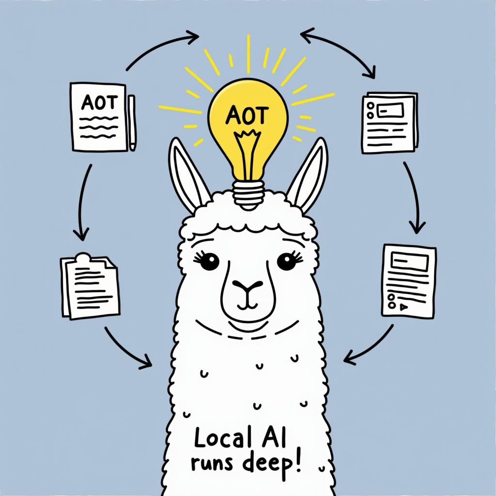

# Today's AI News

## AI Reddit Recap:

**LocalLlama:**

- New **Atom of Thoughts (AOT)** algorithm enhances smaller language models' reasoning capabilities.
- Concerns raised regarding sample size, confidence intervals, and test temperature impacting results.
- Open-source implementation available for exploration.

- **Klee** app allows local running of LLMs without data collection, featuring a RAG knowledge base and note-taking. 
- Users debate backend compatibility, UI, and data privacy.

- Split Brain project proposes a novel dual-decoder architecture for improved model collaboration and flexibility.

**Other Subreddits:**

- Updates from various AI communities are still to be summarized.
