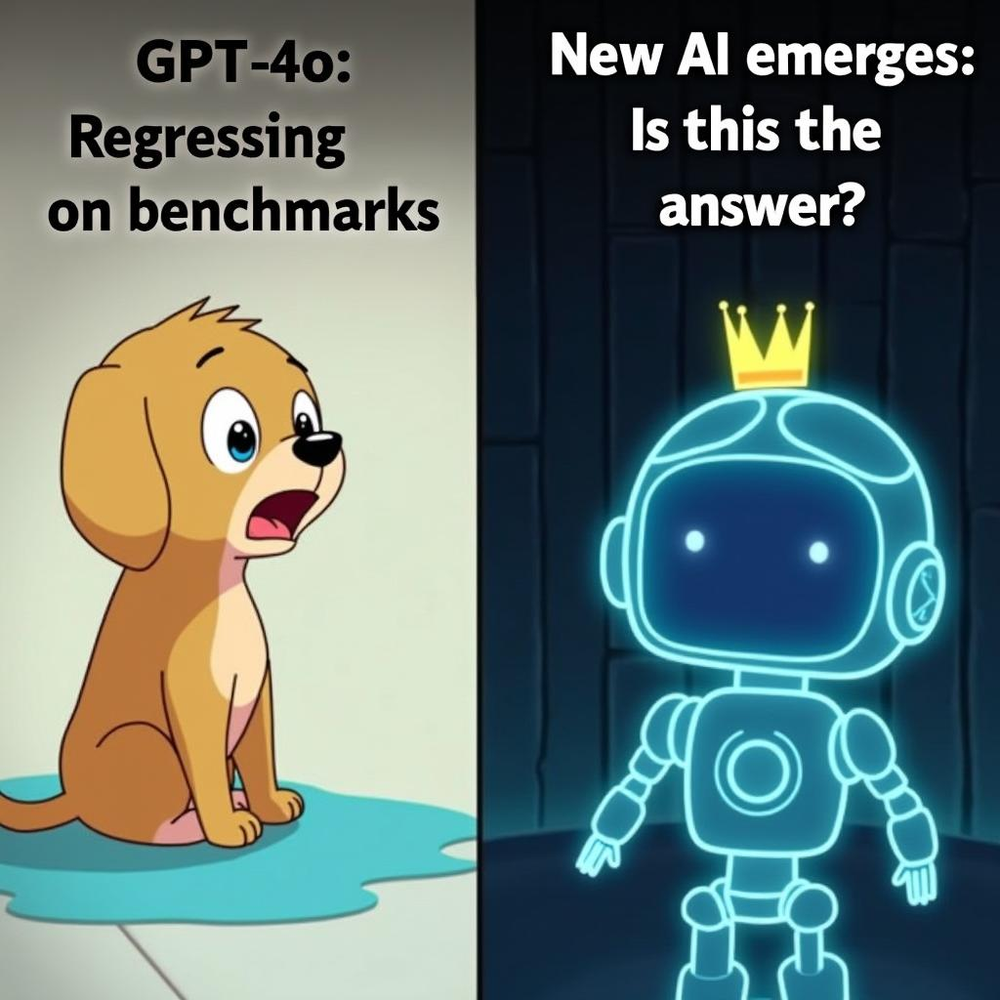

# Today's AI News

## AI Recap: Highlights from November 2023

**Theme 1: Open-Source AI Models:**

- **DeepSeek** emerges as a leading Chinese open-source AI company, achieving similar results to Western models with fewer resources. 
- **OpenScholar** outperforms GPT-4o in scientific research, suggesting potential for smaller institutions.
- **Marco-o1** combines Chain of Thought, Monte Carlo Tree Search, and reasoning action for diverse problem-solving. 
- **INTELLECT-1** completes training using global distributed GPU resources, generating excitement and debate.

**Theme 2: Model Performance and Benchmarks:**

- **GPT-4o** performance regresses on technical benchmarks, raising concerns about its capabilities.
- **ChatGPT** outputs become less comprehensive and factual over time, leading to frustration among users.

**Theme 3: New Video Generation Model:**

- **LTX Video** generates video from text and images in real-time, with promising performance despite hardware limitations.

**Theme 4: Chinese AI Models Compete:**

- Chinese AI models like DeepSeek and ChatGLM offer strong potential and free access, sparking discussions about data privacy concerns and potential censorship.
