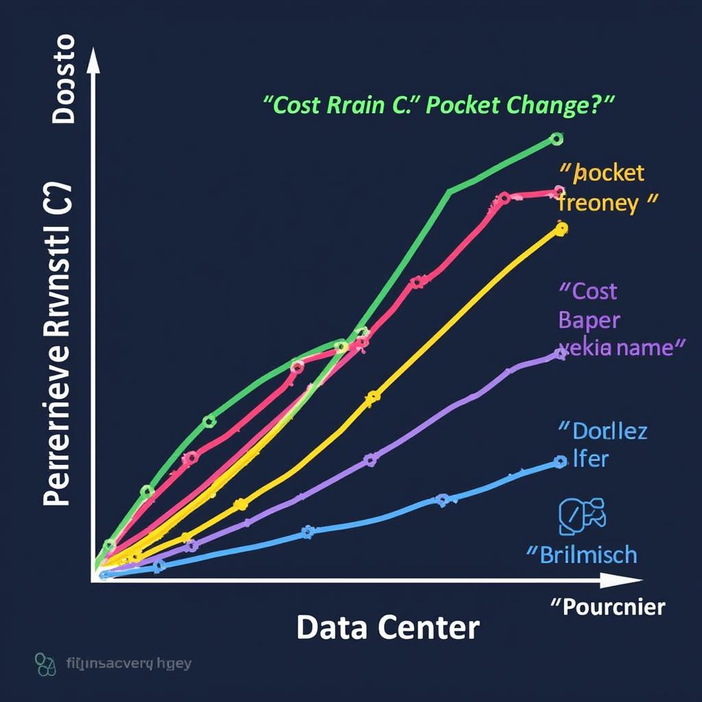

# Today's AI News

## AI Reddit Recap: Interesting Highlights

**DeepSeek V3:**

* Dominates AI workflows with 600 billion parameters.
* Offers versatility and reliability, but faces deployment challenges due to GPU requirements.
* Users report varying performance with prompt length and API stability issues.

**Dolphin 3.0:**

* Released with combination of Llama 3.1, 3.2, and Qwen 2.5.
* Concerns about lack of benchmarks and performance remain.
* Future updates promised, with larger models in training.

**RTX 5090:**

* Rumored to have 1.8 TB/s memory bandwidth, exceeding professional GPUs.
* Lack of VRAM deemed insufficient for AI and gaming needs.
* Cost and power consumption raise concerns.

**LLMs within 24GB VRAM:**

* Users identify models running efficiently within this limit.
* Recommendations and performance metrics discussed.

**OpenAI:**

* Facing financial challenges with subscription models.
* o1-Pro subscription criticized for cost and perceived value.
* Concerns about AI replacing jobs and economic consequences raised.

**AI Level 3 by 2025:**

* OpenAI post predicts the emergence of AI agents by that year.
* Skepticism about impact on companies and individuals.
* Discussions on potential economic and workforce disruptions.

**Efficiency in AI Models:**

* Calls to optimize software rather than simply scaling models.
* GPT-4o shown to be cheaper and smaller than GPT-4.
* Interest in nuclear energy as a sustainable energy solution for AI.
