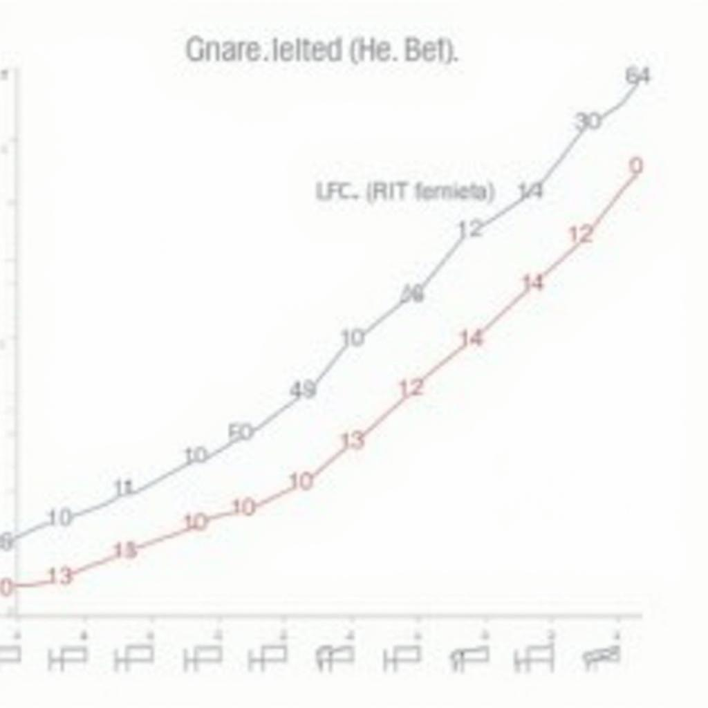

# Today's AI News

## AI Recap Summary:

**Main Themes:**

**1. LLMs and Benchmarks:**

- New LLMs like OuteTTS-0.2-500M demonstrate impressive performance despite their small size.
- Tiny LLMs prove capable for diverse tasks, with some exceeding larger models in benchmarks.
- Chinese LLMs outperform US counterparts in recent tests, raising concerns about US-China AI competition.

**2. AI Scaling & Optimization:**

- Jensen Huang argues that AI scaling is ongoing due to distinct development dimensions like pre-training, post-training, and test-time compute.
- Techniques like Triton Flash Attention and bf16-vae are improving LTX video generation performance.

**3. Advancements in AI Models:**

- IntLoRA is a novel quantization technique for diffusion models, offering memory efficiency through low-rank adaptation.
- Anthropic's Model Context Protocol allows for basic Claude integration with local systems, enabling wider applicability.

**4. Tool & Workflow Development:**

- SmolLM2 toolkit provides comprehensive tools for LLM training and evaluation.
- Regional Prompting workflow boosts Flux video generation capabilities.

**Other Highlights:**

- O1-preview model performance on AIME 2024 metrics is surpassed by newer models.
- Flux and Stable Diffusion communities discuss content monetization strategies.
- IntLoRA offers memory-efficient training and inference for diffusion models.
