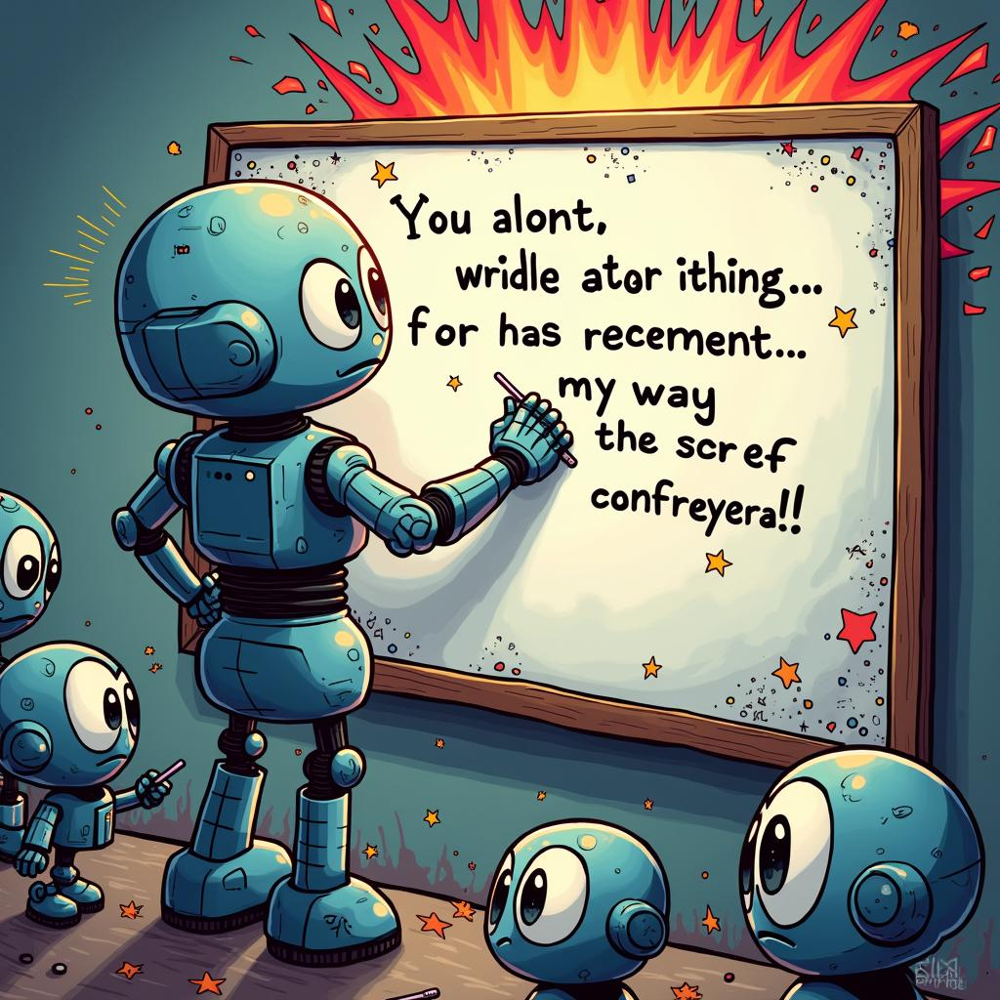

# Today's AI News

## AI Reddit Recap:

**Salesforce and AI:**
- Salesforce is planning to stop hiring software engineers by 2025 due to AI advancements, sparking debate about AI's impact on the profession.

**ChatGPT's Quirks:**
- A humorous discussion emerged around ChatGPT's occasional nonsensical responses, suggesting its limitations in complex tasks.

**Model Performance and Updates:**
- Phi-4 AI model received bug fixes and improvements, including 2x faster fine-tuning and compatibility with multiple frameworks. 
- Groq model faced criticism for quantizing models excessively, leading to reduced precision.

**Transparency in Generative Models:**
- TransPixar, a new generative model, stands out for its ability to preserve transparency in generated assets, opening doors for applications in game development.

**Manufacturing and AI:**
- Speculation arose around NVIDIA Project DIGITS potential memory bandwidth, leading to discussions about its cost-effectiveness and performance compared to other systems.
