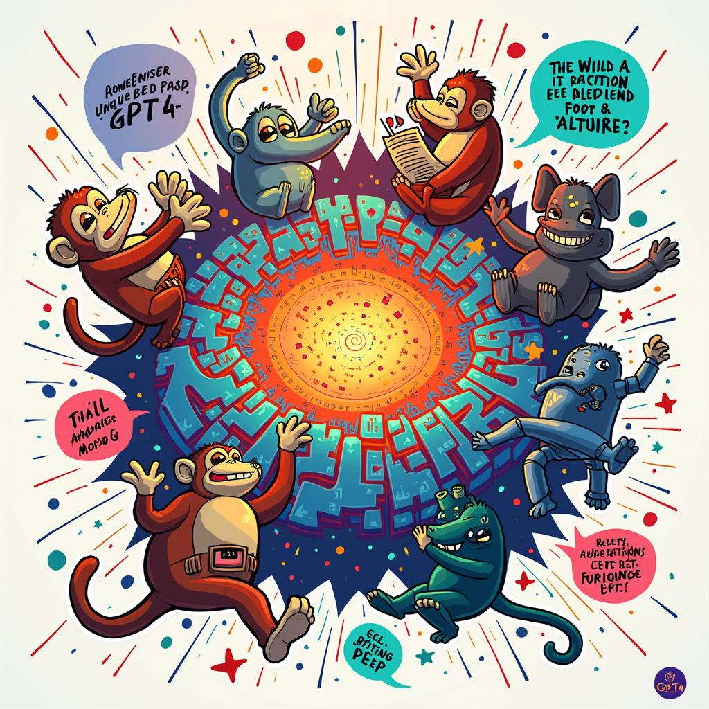

# Today's AI News

## AI Reddit Recap Summary:

**1. Llama 3.3 70B:**

- New model from Meta outperforms previous versions and GPT-4o at a lower cost.
- Impressed with large context size (128K) and multilingual capabilities.
- Ongoing discussions about quantization for wider accessibility.

**2. Open-Source O1:**

- Users express dissatisfaction with the performance and reliability of the new o1 model.
- Call for open-source models like QwQ due to stability and predictability.
- Concerns about OpenAI prioritizing profit over technical advancements.

**3. Windsurf Cascade System Prompts:**

- Complex prompts are surprisingly effective despite numerous negative rules.
- Use of HTML-style tags improves prompt structure and focus.
- Discussion about the effectiveness of positive reinforcement in prompts.

**4. Hugging Face Course: Preference Alignment for LLMs:**

- Free course teaching how to align LLMs with user preferences. 
- Covers concepts like Argilla, distilabel, and TRL. 
- Designed for local model training and usage.

**5. Adobe Releases DynaSaur Code:**

- Agent capable of coding itself.
- Concerns about potential system damage and need for confidence scoring to prevent runaway iterations.

**Other Highlights:**

- GPT-4.5 showcases impressive capabilities in creative language tasks, delivering critical commentary on the insurance industry.
- Discussions highlight the evolving capabilities and potential radicalization of ChatGPT.
