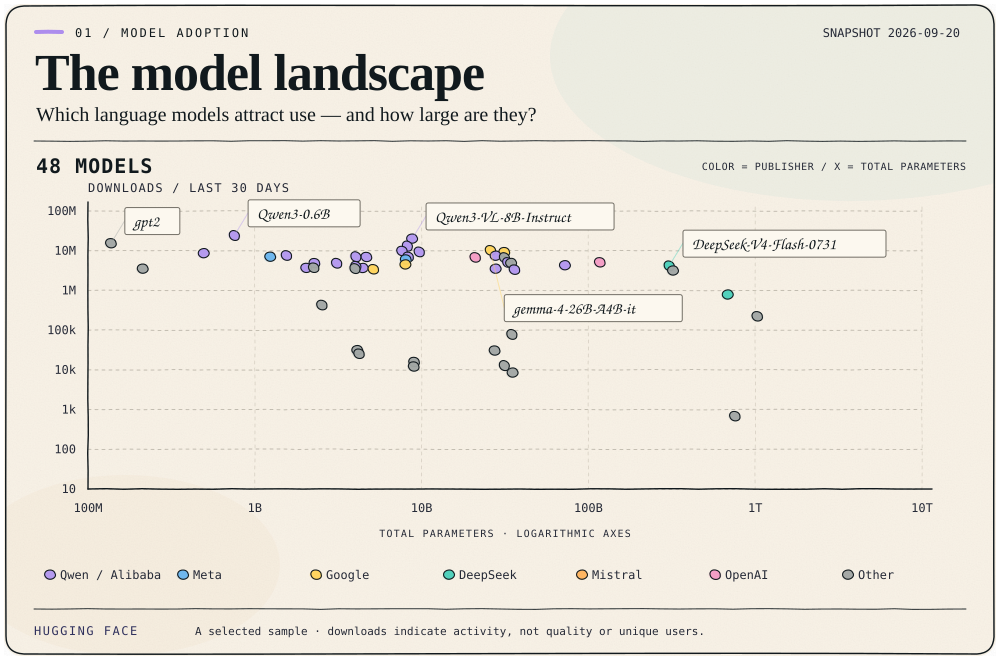
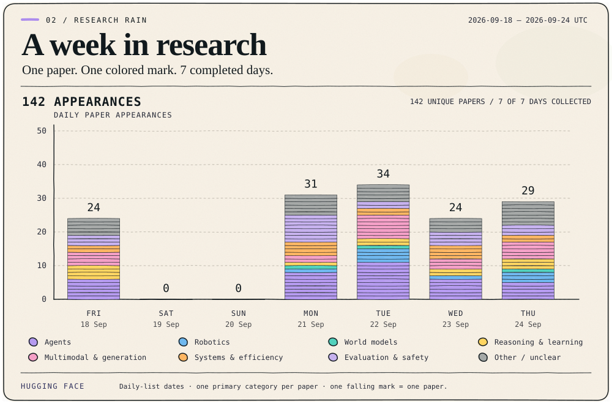

# AI, in perspective

A small observatory for builders and researchers: which language models attract use, and where this week’s research is going.

[Explore the models](reports/models.md) · [Still image](assets/models-static.svg)

[Read the papers](reports/papers.md) · [Still image](assets/papers-static.svg)

Snapshots from Hugging Face · model downloads measure activity, not quality · papers follow HF daily-list dates · animations play once

[How it works](OPERATIONS.md) · [Label comparison](reports/label-comparison.md) · [Design](design_doc.md) · [Collection status](data/status.json)
