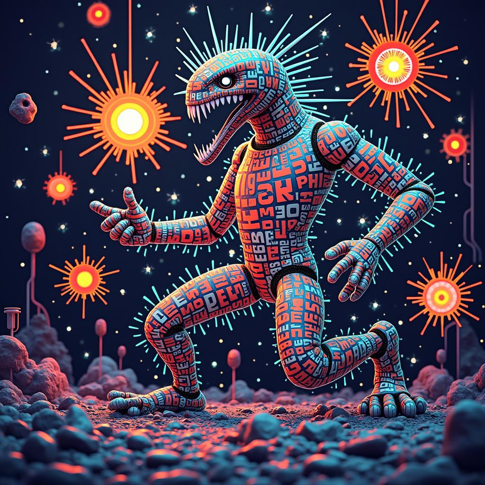

# Today's AI News

## AI Reddit Recap: December 11, 2024

**Highlights:**

**1. Google's Gemini 2.0:**

* Outperforms Claude Sonnet 3.5 on benchmarks.
* Larger context window and potential for wider applicability.
* Competitive pricing strategy raising concerns about OpenAI's offerings.

**2. New Linear Models:**

* Recursal announces two experimental models, QRWKV6-32B and Finch-MoE-37B-A11B, with improved efficiency through RWKV attention mechanism.
* Potential for future advancements and wider application in reasoning models.

**3. Speculative Decoding for QwQ-32B:**

* Users test speculative decoding technique using smaller model to speed up larger model.
* Subjective improvements in logic observed, but results vary.
* Need for clearer implementation details and more empirical evidence.

**4. Google's GenCast AI Weather Model:**

* Achieves 97% accuracy in 15-day weather forecasts across 35 countries.
* Skepticism about long-term accuracy and potential reliance on historical data.

**5. ChatGPT Downtime:**

* Major outage affecting ChatGPT, API, and Sora services.
* Users express frustration and dependence on the tool, highlighting its importance for learning and work.
* Potential impact of recent updates and iOS 18.2 on server capacity.

**6. Sora AI Criticism:**

* Severe criticisms of its poor video generation capabilities and high cost.
* Concerns about quality, realism, and inappropriate output.
* User disappointment and concerns about OpenAI's product development process.
