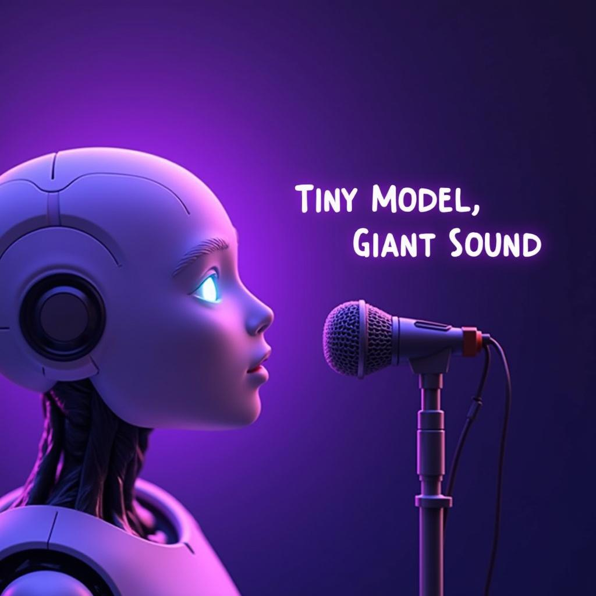

# Today's AI News

## Interesting AI News:

**1. ElevenLabs' Superior TTS:** This text-to-speech technology uses actual audiobook data and a relatively small compute setup to achieve exceptional quality, exceeding expectations of local models.

**2. OpenWebUI Expands Canvas Support:** The web design tool is adding multi-language support for various programming languages and expanding its features with design and code view options.

**3. DeepSeek V3 vs Claude 3.5 Sonnet:** This open-source model offers cost-effective performance comparable to Sonnet, making it ideal for routine tasks, while Sonnet still reigns supreme for complex projects and nuanced outputs.

**4. OpenAI User Frustrations:** While AI automation offers benefits, it also comes with challenges. Users highlighted persistent reminders set by ChatGPT despite cancellation attempts, showcasing the potential for AI misalignment in practical applications.
